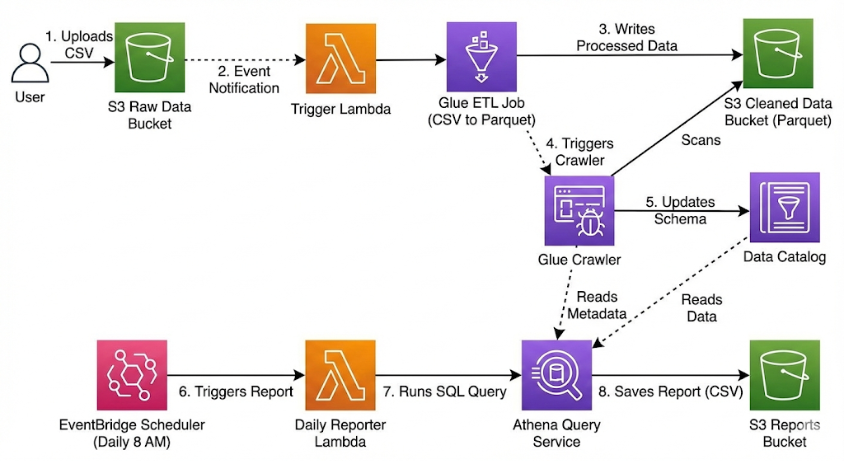

# Serverless AWS Data Pipeline

A fully automated, serverless data pipeline on AWS that ingests raw CSV data, transforms it into optimized Parquet format using AWS Glue, automates schema discovery with Glue Crawlers, and generates daily business reports using Amazon Athena and AWS Lambda.

## 🏗 Architecture



The pipeline follows an **Event-Driven Architecture**:

1.  **Ingestion:** User uploads a CSV file to S3 (`/raw`).
2.  **Trigger:** S3 Event Notification triggers a Lambda function.
3.  **ETL Processing:** Lambda starts an AWS Glue Job to clean data and convert it to Parquet.
4.  **Discovery:** Glue Job automatically triggers a **Glue Crawler** to update the Data Catalog schema.
5.  **Reporting:** Amazon EventBridge triggers a **Daily Reporter Lambda** (at 8:00 AM UTC).
6.  **Analysis:** The Reporter runs a SQL query via **Amazon Athena** and saves the result to S3 (`/reports`).

## 📸 Workflow & Screenshots

### AWS Glue Job Execution
*The ETL job processes raw CSVs and converts them to Parquet format.*


## 🚀 Features

* **Serverless:** No EC2 instances to manage; uses Lambda and Glue.
* **Infrastructure as Code (IaC):** Entire infrastructure defined in **Terraform**.
* **Automated Schema Evolution:** Handles new columns automatically via Glue Crawler.
* **Cost Optimized:** Uses Parquet format for efficient storage and querying.
* **Automated Reporting:** Schedules and delivers daily insights without manual intervention.

## 🛠 Tech Stack

* **Cloud Provider:** AWS
* **IaC:** Terraform
* **Compute:** AWS Lambda (Python 3.9), AWS Glue (Spark)
* **Storage:** Amazon S3
* **Database:** AWS Glue Data Catalog, Amazon Athena
* **Orchestration:** Amazon EventBridge (Scheduler)

## 📂 Project Structure

```bash
.
├── main.tf                 # Terraform Infrastructure definition
├── images/                 # Folder for screenshots/diagrams
│   ├── architecture_diagram.png
│   └── glue_job_screenshot.png
├── src
│   ├── glue
│   │   └── etl_script.py   # Spark script for CSV -> Parquet & Crawler trigger
│   └── lambda
│       ├── trigger.py      # Lambda to start Glue Job
│       └── daily_report.py # Lambda to run Athena Query
└── README.md
```

## 📋 Prerequisites

* **AWS CLI** installed and configured with appropriate permissions.
* **Terraform** (v1.0+) installed.
* **Git** installed.

## ⚡ Deployment Instructions

1.  **Clone the Repository**
    ```bash
    git clone [https://github.com/your-username/serverless-data-pipeline.git](https://github.com/your-username/serverless-data-pipeline.git)
    cd serverless-data-pipeline
    ```

2.  **Initialize Terraform**
    ```bash
    terraform init
    ```

3.  **Deploy Infrastructure**
    Review the plan and apply changes.
    ```bash
    terraform plan
    terraform apply -auto-approve
    ```
    *Note: Terraform will automatically zip your Lambda functions and upload your Glue scripts to S3.*

## 🕹 Usage

### 1. Ingest Data
Upload any CSV file to the `raw/` folder in your S3 bucket.
```bash
aws s3 cp test_data.csv s3://YOUR_BUCKET_NAME/raw/
```

### 2. Verify Processing
* **Glue Job:** Check the AWS Glue Console to see the job `csv-to-parquet-cleaner` running.
* **Data Catalog:** Once finished, check the **Glue Crawler** status. It will update the table `cleaned_data` in the `my_pipeline_db` database.
* **Athena:** Run a query in Athena to see your data:
    ```sql
    SELECT * FROM "my_pipeline_db"."cleaned_data" LIMIT 10;
    ```

### 3. Generate Report
The report runs automatically at **8:00 AM UTC**. To trigger it manually:
1.  Go to the AWS Lambda Console -> `daily-reporter` function.
2.  Click **Test**.
3.  Check the output CSV in `s3://YOUR_BUCKET_NAME/reports/`.

## 📊 Monitoring

* **CloudWatch Logs:**
    * `/aws/lambda/pipeline-trigger`: Logs for S3 event triggers.
    * `/aws/glue/jobs/output`: Logs for ETL processing.
    * `/aws/lambda/daily-reporter`: Logs for report generation errors.

## 🧹 Cleanup

To avoid ongoing charges, destroy the infrastructure when done:

```bash
# Empty the S3 bucket first (Terraform cannot delete non-empty buckets)
aws s3 rm s3://YOUR_BUCKET_NAME --recursive

# Destroy resources
terraform destroy -auto-approve
```